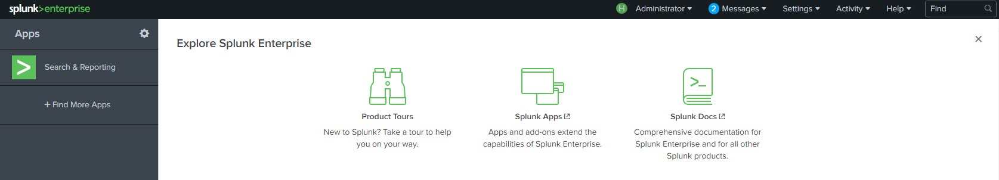
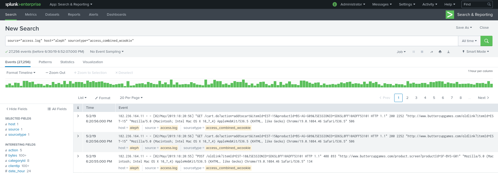

# Getting Started with Splunk

<!-- pandoc -t html5 -s --toc --katex -c pandoc.css --metadata pagetitle="Getting Started with Splunk" ./memes.md > memes.html -->

What you'll learn from this article:

- What is splunk
- How to install Splunk
- How to get Data into Splunk (basic)
- Essential splunkweb interface features and controls
- How to write basic Search Processing Language (SPL) search strings
- How to create filters to reduce the amount of data returned from searches
- How to visualize searches and create dashboards

## What is Splunk

To summarize what Splunk is without watering down all the awesome stuff it can do, you can think of it like this: "It's like Google for all kinds of machine data!"

Every company has a gazillion applications and servers, databases and network devices like routers - and all of them create log files that record their activities and statuses over time. Troubleshooting a single problem in this sea of machine data, or monitoring their status would be a pain to do manually! 

That's where Splunk comes in and collects all this machine data in one place making it easy to search and investigate data, just like Google does for the web!

## How to install Splunk

Before doing anything you have to install Splunk. To do that, you have to go on their page and [create a new account](https://www.splunk.com/page/sign_up?redirecturl=https://hackathon.consist.de). After you've done that, log in and [download their client](https://www.splunk.com/en_us/download/splunk-enterprise.html) on the platform of your choice. For more instructions on that, have a look at [the official docs](https://docs.splunk.com/Documentation/Splunk/latest/Installation/Chooseyourplatform). 

After you've successfully installed it, open your browser and enter  `http://localhost:8000/` in the URL bar.

There you can enter your Splunk login credentials[^0]. Once logged in click on the "Search & Reporting" app on the bar on the left.



[^0]:If you haven't set any, the username is `admin` and password is `changeme`

## Getting Data into Splunk

Now, the search view is empty because there's no data. So let's import some.

In the upper left corner, click on the Splunk logo. That will take you to the home screen. From here, click on "Add Data".

In this screen you have multiple options of how to get data into Splunk. All we want for now is to upload a set of data. Click on the Upload button. 

Once there, you can download [this dataset](#) and upload it to Splunk by either drag and dropping it there or selecting it with "Select File". Splunk can handle many different data types, but in our case it is already in the format we want so you'll just have to click "next" in every set up screen. Once done, click on "Start searching", which will take you back to the search app. 

## The SplunkWeb Interface



This is the place you'll be spending most of your time. You already have an initial search command which shows you only the data you've imported.

The search command is written in the **Search Processing Language (SPL)**. All your searches are based around two factors:

- finding and filtering the data to include only the events you're looking for
- selecting the appropriate time range the events occured in.[^1]

[^1]: We recommend to have "All time" checked (in the "others" section of time) when following this getting started article.

On the left panel you can see fields that Splunk has recognise`d under **IMPORTANT FIELDS**.

Clicking on the **status** field shows you exactly which status codes and how often they show up in the dataset, giving up very powerful information - how the server performs - at a glance. There you also find a couple of quick useful searches under **Reports**.

## The SPL language

A splunk search is a series of commands and arguments chained together using the pipe character (`|`) such that the output of one command is fed into the next command to the right.

In abstract it looks somewhat like this:

```spl
index=<index> <filter> <"text string to match"> 
| command1 <arguments> 
| command2 <arguments> 
| visualization commands & arguments
```

Newlines are inserted by pressing <kbd>Ctrl</kbd> + <kbd>Enter</kbd> simultaniously.

Effective searches can be created by following some basic steps, by building search commands progressively and iteratively, always making sure that you get the results you expect and understanding what each command does.

There are a couple of resources to go through if you don't know how a command works, like the Splunk [(sp)lexicon](https://docs.splunk.com/Splexicon) or [docs](https://docs.splunk.com/Documentation) or [answers](https://answers.splunk.com/index.html) or look it up on [StackOverflow](https://stackoverflow.com/questions/tagged/splunk). Review the examples given and experiment with the command until you are confident in using it yourself.

Here are the basic steps to building a SPL search string:

1. Specify an index and time range that will retrieve all of the events you're interested in.
2. Add filters to better specify and reduce the number of events to just those you want to work with, and eliminate the rest.
3. Progressively pipe the events/data to the next command plus any applicable arguments and check that you get what you expected from each step.
4. Pipe the final dataset to a table, chart, or time chart for visualization and adjust the visualisation settings.
5. When the search is working as desired, save it to a report, dashboard panel, or alert as desired.

### Search filters

Applying filters is essential in isolating the search results to just the events that interest you.

You can search by keywords, text strings or simple logic statements. A statement that has all of these is: ` "addtocart" AND status >= 400`

There is an implied `AND` between all filter parts in a search command, so we could rewrite the previous one as: `"addtocart" status >= 400`.

This command shows all events that contain the text string "addtocart" and has a keyword "status" with a value bigger or equal to 400.

You can also specify other logic tools like `OR` or `NOT` in your search filters, use parantheses for grouping or utilise [wildcards](https://docs.splunk.com/Documentation/Splunk/latest/Search/Wildcards) (asterisks). Using `NOT` and wildcards a lot can be heavy and slow down your searches, so use them wisely. 

Here's another example that uses all of these search tools: `sourcetype=*access* (status = 400 OR status = 404) NOT "addtocart"`.

### Search commands

There are two very important commands in SPL, `eval` and `stats`, but in this section we will only cover `stats`.

The `stats` command is used to perform statistical functions. Here are some examples with the fictive value of "time_traveled":

| Function          | Example                                           |
| ----------------- | ------------------------------------------------- |
| `avg(x)`          | `stats avg(time_traveled) as average_travel_time` |
| `count(x)`        | `stats count(time_traveled) by time_traveled`     |
| `max(x) / min(x)` | `stats max(time_traveled) as longest_travel_time` |
| `sum(x)`          | `stats sum(time_traveled) as total_travel_time`   |

The returned value of these functions has the name given after the `as` keyword, like `average_travel_time` above. If there's no `as` present, then the function name will be shown instead, like the `count(time_traveled)` above.

You can get more info on [Eval](http://docs.splunk.com/Documentation/Splunk/latest/SearchReference/Eval) and [Stats](http://docs.splunk.com/Documentation/Splunk/latest/SearchReference/Stats) in the official documentation.

## Visualizing Searches

At this point you can build simple searches, now how about visualizing them? 

### table

You can pipe events into `table` and get the event fields arranged from left to right.

In the next example we take all events (`*`) and pipe them to table with: ```* | table *```


### chart

You can prepare the results to be displayed in a chart (bar, column, line, area or pie chart) with the `chart` command. 

The syntax is as follows:

```... | chart <chart-options> <stats or aggregation function> BY <column-split>```

```or```

```... | chart <stats or agg function> OVER <row-split> BY <column-split>```


And here's a simple example where we count the useragents (e.g. types of browsers) that visited our servers in the sample data with:  `* | chart limit=3 count by useragent`


### timechart

`timechart` looks at a field (it's values shown on the Y-axis) and how it changes over time (shown over the X-axis).  

Here's an example using timechart to show the average data transmitted by different useragents:

```* | timechart avg(bytes) by useragent```


## Next steps

Things that we did not cover in this article that you should definetly look up are ways to visualize your data and creating dashboards. Splunk has a [getting started article](https://docs.splunk.com/Documentation/Splunk/latest/Viz/Aboutthismanual) for both these topics.

The next best thing you can do is play around with the dataset you have previously downloaded. Or better yet, you can go to a site like [kaggle](https://www.kaggle.com/datasets) to find a dataset that you may like to Splunk.

There is the [official tutorial](https://docs.splunk.com/Documentation/Splunk/latest/SearchTutorial/WelcometotheSearchTutorial) for Splunk you can go through if you want to learn more and the book we highly recommend is [Splunk 7.x Quick Start Guide](https://www.packtpub.com/eu/big-data-and-business-intelligence/splunk-7x-quick-start-guide).

# Big Data

Every company has a gazillion applications and servers, databases and network devices like routers - and all of them create log files that record their activities and statuses over time. Troubleshooting a single problem in this sea of machine data, or monitoring their status would be a pain to do manually!

That's where Splunk comes in and collects all this machine data in one place making it easy to search and investigate data, just like Google does for the web!

# Search

When dealing with big data you will use search commands to find and filter the results you're looking for. The search commands in Splunk are written in the **Search Processing Language (SPL)**.

The power and ease of use of SPL is one of the main reasons why Splunk is so wide spread. It allows everyone to solve their Big Data problems in no time!

# Dashboards

Dashboards allow you to group together information in one coherent view, making it easier to get an overview and understand what's going on with your data.