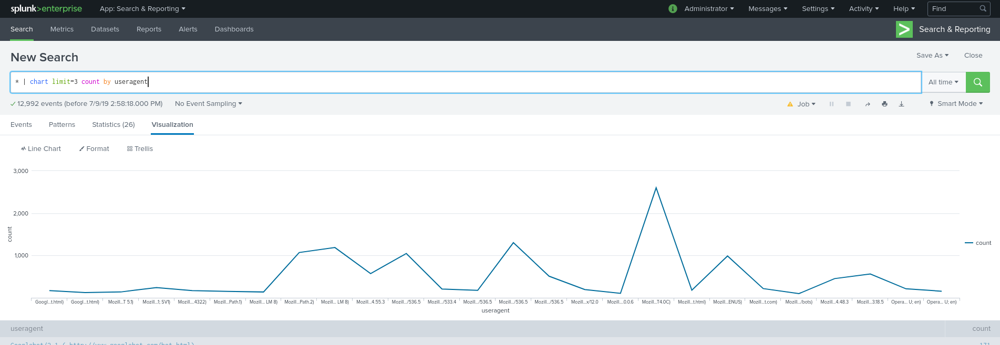

# Erste Schritte mit Splunk

<!-- pandoc -t html5 -s --toc --katex -c pandoc.css --metadata pagetitle = "Erste Schritte mit Splunk" ./memes.md> memes.html -->

Was du aus diesem Artikel lernen wirst:

- Was ist Splunk?
- Splunk installieren
- Wie bekomme ich Daten in Splunk (Grundkenntnisse)
- Wesentliche Funktionen und Steuerelemente für die Benutzeroberfläche von Splunkweb
- So schreibst du SPL-Befehle (Basic Search Processing Language)
- So erstellst du Filter, um die von Suchvorgängen zurückgegebene Datenmenge zu reduzieren
- Visualisieren von Suchen und Erstellen von Dashboards 

## Was ist Splunk?

Um zusammenzufassen, was Splunk ist, ohne all die fantastischen Dinge zu verwässern, die es kann, kannst du dir das so vorstellen: "Es ist wie Google für alle Arten von Maschinendaten!"

Jedes Unternehmen verfügt über eine Unmenge von Anwendungen und Servern, Datenbanken und Netzwerkgeräten wie Routern - und alle erstellen Protokolldateien, in denen ihre Aktivitäten und ihr Status im Laufe der Zeit aufgezeichnet werden. Die Behebung eines einzelnen Problems in diesem Meer von Maschinendaten oder die Überwachung ihres Status wäre mühsam von Hand!

Hier kommt Splunk ins Spiel und sammelt all diese Maschinendaten an einem Ort. So kannst du ganz einfach nach Daten suchen und suchen, genau wie bei Google für das Web!

## Splunk installieren

Zunächst solltest du Splunk installieren. Dazu gehst du auf deren Seite und erstellt [ein neues Konto](https://www.splunk.com/page/sign_up?redirecturl=https://hackathon.consist.de). Danach lädst du [Splunk Enterprise](https://www.splunk.com/en_us/download/splunk-enterprise.html) herunter. Weitere Anweisungen hierzu findest du in [den offiziellen Dokumenten](https://docs.splunk.com/Documentation/Splunk/latest/Installation/Chooseyourplatform).

Nachdem du es erfolgreich installiert hast, öffne dein Browser und gib `http://localhost:8000/` in die URL-Leiste ein.

Dort kannst du dein Splunk-Zugangsdaten eingeben [^ 0]. Sobald du eingeloggt bist, klick auf die "Search & Reporting" App in der linke Leiste.


[^ 0]: Wenn du keinen User festgelegt hast, lautet der Benutzername "admin" und das Kennwort "changeme"

## Daten in Splunk importieren

Die Suchansicht ist jetzt leer, da keine Daten vorhanden sind. Also lass uns welche importieren.

Klick oben links auf das Splunk-Logo. Damit gelangst du zum Startbildschirm. Klick dann auf "Daten hinzufügen".

In diesem Bildschirm hast du mehrere Möglichkeiten, wie du Daten in Splunk übertragen kannst. Im Moment wollen wir nur einen Datensatz hochladen. Klicke auf die Schaltfläche "Hochladen".

So kannst du [diesen Datensatz herunterladen](#) und auf Splunk hochladen, indem du ihn entweder dort ziehst und ablegst oder mit "Datei auswählen" einfügst. Splunk kann mit vielen verschiedenen Datentypen umgehen, aber in unserem Fall hat es bereits das gewünschte Format, sodaß du in jedem Setup-Bildschirm einfach auf "Weiter" klicken musst. Klicke anschließend auf "Suche starten", um zur Such-App zurückzukehren.

## Das SplunkWeb Interface


Dies ist der Ort, an dem du die meiste Zeit verbringen wirst. Du hast bereits einen ersten Suchbefehl, der nur die Daten anzeigt, die du importiert hast.

Der Suchbefehl ist in der **Search Processing Language (SPL)** geschrieben. All deine Suchanfragen basieren auf zwei Faktoren:

- Suchen und Filtern der Daten, um nur die von dir gesuchten Ereignisse einzuschließen
- Auswahl des geeigneten Zeitraums, in dem die Ereignisse aufgetreten sind. [^ 1]

[^ 1]: Wir empfehlen, "All time" (im Abschnitt "others") zu aktivieren, wenn du diesem "Getting Started"-Artikel folgst.

Auf der linken Seite siehst du Felder, die Splunk unter **WICHTIGE FELDER** erkannt hat.

Wenn du auf das Feld **Status** kickst, siehst du genau welche Statuscodes und wie oft sie im Datensatz angezeigt werden. Auf einen Blick erhältst du sehr aussagekräftige Informationen - wie der Server funktioniert. Dort findest du auch einige nützliche Schnellsuchen unter **Berichte**.

## Die SPL-Sprache

Eine Splunk-Suche besteht aus einer Reihe von Befehlen und Argumenten, die mit dem Pipe-Zeichen (`|`) so verkettet sind, daß die Ausgabe der vorigen Befehls in den nächsten Befehl rechts einfließt.

Ein Zusammenfassung sieht ungefähr so aus:

```spl
index = <index> <filter> <"Zu vergleichende Textzeichenfolge">
| Befehl1 <Argumente>
| Befehl2 <Argumente>
| Visualisierungsbefehle & Argumente
```

Zeilenumbrüche werden durch gleichzeitiges Drücken von <kbd>Strg</kbd> + <kbd>Eingabetaste</kbd> eingefügt.

Effektive Suchvorgänge können mithilfe einiger grundlegender Schritte erstellt werden, indem Suchbefehle schrittweise und iterativ erstellt werden. Dabei muss stets sichergestellt werden, dass du die erwarteten Ergebnisse erzielst und verstehst was die einzelnen Befehle bewirken.

Hier sind die grundlegenden Schritte zum Erstellen einer SPL-Suchzeichenfolge:

1. Gib einen Index und einen Zeitraum an, in dem alle Ereignisse abgerufen werden, an denen du interessiert bist.
2. Füge ein Filter hinzu, um die Anzahl der Ereignisse besser zu spezifizieren und auf den Anteil zu reduzieren womit du auch arbeiten willst.
3.  Entwickle eine Kette von Befehlen und Filter schrittweise und prüfe, ob du auch das bekommst, was du von jedem Schritt erwartest.
4. Visualisiere den endgültigen Datensatz mit einer Tabelle, einem Diagramm oder einem Zeitdiagramm und pass die Visualisierungseinstellungen an.
5. Wenn die Suche wie gewünscht funktioniert, speichere es in einem Bericht, einem Dashboard oder einer Warnmeldung.

### Suchfilter

Das Anwenden von Filtern ist wichtig, um die Suchergebnisse auf die Ereignisse zu beschränken, die dich interessieren.

Du kannst nach Schlüsselwörtern, Textzeichenfolgen oder einfachen logischen Anweisungen suchen. Eine Anweisung mit all diesen Eigenschaften lautet: "addtocart" AND status> = 400 "

Zwischen allen Filterteilen in einem Suchbefehl gibt es ein implizites `AND`, sodass wir das vorherige Statement auch als `"addtocart" AND Status >= 400` schreiben können.

Dieser Befehl zeigt alle Ereignisse an, die die Textzeichenfolge "addtocart" enthalten und ein Schlüsselwort "status" mit einem Wert größer oder gleich 400 haben.

Du kannst in deinen Suchfiltern auch andere logische Werkzeuge wie `OR` oder `NOT` angeben, Klammern zum Gruppieren oder Platzhalter / [wildcards](https://docs.splunk.com/Documentation/Splunk/latest/Search/Wildcards) (Sternchen) verwenden. Das Verwenden von `NOT` und Wildcards kann viel Zeit in Anspruch nehmen und Ihre Suche verlangsamen. Verwende sie daher mit Bedacht.

Hier ist ein weiteres Beispiel, das alle diese Suchwerkzeuge verwendet:

```sourcetype = * access * (status = 400 OR status = 404) NOT" addtocart "```.

### Suchbefehle

Es gibt zwei sehr wichtige Befehle in SPL, `eval` und` stats`, aber in diesem Abschnitt werden wir nur `stats` behandeln.

Mit dem Befehl "stats" werden statistische Funktionen ausgeführt. Hier sind einige Beispiele mit dem fiktiven Wert "time_traveled":

| Funktion            | Beispiel                                           |
| ------------------- | -------------------------------------------------- |
| `avg (x)`           | `stats avg (time_traveled) as average_travel_time` |
| `count (x)`         | `stats count (time_traveled) by time_traveled`     |
| `max (x) / min (x)` | `stats max (time_traveled) as longest_travel_time` |
| `sum (x)`           | `stats sum (time_traveled) as total_travel_time`   |

Der zurückgegebene Wert dieser Funktionen hat den Namen der nach dem Schlüsselwort "as" angegeben ist, wie oben "average_travel_time". Wenn kein "as" vorhanden ist wird stattdessen der Funktionsname angezeigt, wie oben "count (time_traveled)".

Weitere Informationen erhälst du unter [Eval](http://docs.splunk.com/Documentation/Splunk/latest/SearchReference/Eval) und [Stats](http://docs.splunk.com/Documentation/Splunk/latest/SearchReference/Stats) in der offiziellen Dokumentation.

## Visualisierung von Suchen

An dieser Stelle kannst du einfache Suchanfragen erstellen. Wie wäre es nun mit deren Visualisierung?

### table

Du kannst Ereignisse in eine "Tabelle" umleiten und die Ereignisfelder von links nach rechts anordnen.

Im nächsten Beispiel nehmen wir alle Ereignisse (`*`) und leiten sie zur Tabelle mit: ```* | table *


### chart

Mit dem Befehl "chart" kannst du die Ergebnisse für die Anzeige in einem Diagramm (Balken-, Spalten-, Linien-, Flächen- oder Tortendiagramm) vorbereiten.

Die Syntax lautet wie folgt:

```... | chart <Diagrammoptionen> <Statistik oder Aggregationsfunktion> BY <Spaltenaufteilung>```

```oder```

```... | chart <Statistik oder Agg-Funktion> OVER <Zeilensplit> BY <Spaltensplit> ```



Und hier ist ein einfaches Beispiel, in dem wir die Benutzeragenten (z. B. Browsertypen), die unsere Server besucht haben in den Beispieldaten mit `* | count Diagrammlimit = 3 count by useragent` zeigt.

### timechart

`timechart` betrachtet ein Feld (seine Werte werden auf der Y-Achse angezeigt) und wie es sich mit der Zeit ändert (über der X-Achse angezeigt).

Hier ist ein Beispiel in dem mithilfe eines Zeitdiagramms die durchschnittlichen Daten angezeigt werden, die von verschiedenen Benutzeragenten übertragen wurden:

```* | timechart avg (bytes) von useragent```


## Nächste Schritte

Dinge, die wir in diesem Artikel nicht behandelt haben und die du unbedingt nachschlagen solltest sind Möglichkeiten deine Daten zu visualisieren und Dashboards zu erstellen. Splunk bietet für beide Themen einen [Artikel zum Einstieg](https://docs.splunk.com/Documentation/Splunk/latest/Viz/Aboutthismanual) an.

Das nächstbeste was du tun könntest, ist mit dem zuvor heruntergeladenen Datensatz herumzuspielen. Oder noch besser, du kannst zu einer Seite wie [kaggle](https://www.kaggle.com/datasets) gehen, um einen Datensatz zu finden, den du gerne splunken würdest.

Es gibt das [offizielle Tutorial](https://docs.splunk.com/Documentation/Splunk/latest/SearchTutorial/WelcometotheSearchTutorial) für Splunk, das du durchgehen kannst, wenn du mehr erfahren möchtest und wir empfehlen das Buch [Splunk 7.x Quick Start Guide](https://www.packtpub.com/eu/big-data-and-business-intelligence/splunk-7x-quick-start-guide).

# Big Data

Jedes Unternehmen verfügt über eine Unmenge von Anwendungen und Servern, Datenbanken und Netzwerkgeräten wie Routern - und alle erstellen Protokolldateien, in denen ihre Aktivitäten und ihr Status im Laufe der Zeit aufgezeichnet werden. Die Behebung eines einzelnen Problems in diesem Meer von Maschinendaten oder die Überwachung ihres Status wäre mühsam von Hand!

Hier kommt Splunk ins Spiel und sammelt all diese Maschinendaten an einem Ort. So kannst du ganz einfach nach Daten suchen und suchen, genau wie bei Google für das Web!

# Suche

Beim Umgang mit Big Data verwendest du Suchbefehle um die gesuchten Ergebnisse zu finden und zu filtern. Die Suchbefehle in Splunk sind in der **Search Processing Language (SPL)** geschrieben.

Die Leistungsfähigkeit und Benutzerfreundlichkeit von SPL ist einer der Hauptgründe, warum Splunk so weit verbreitet ist. Es ermöglicht jedem, seine Big-Data-Probleme in kürzester Zeit zu lösen!

# Dashboards

Mithilfe von Dashboards kannst du Informationen in einer zusammenhängenden Ansicht zusammenfassen, um einen Überblick zu verschaffen und zu verstehen was mit Ihren Daten geschieht.
